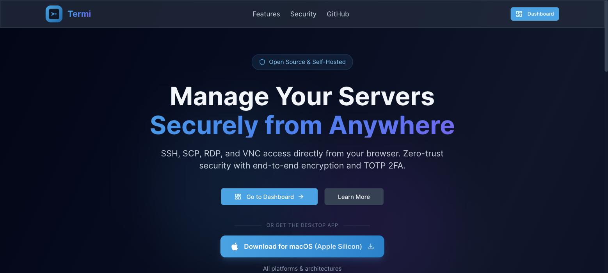
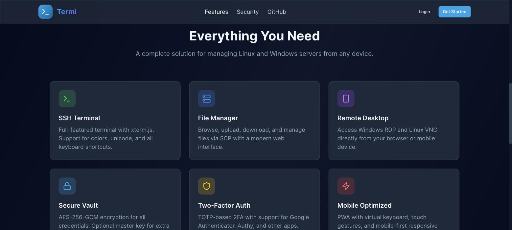

<div align="center">

# 🖥️ Termi

**Self-hosted server management — SSH, SCP, RDP, VNC & local terminal from your browser or desktop**

_Termi runs in production at **[termi.run](https://termi.run)** — try it there, or follow [Quick Start](#-quick-start) to self-host your own instance._

[](https://github.com/shuv-o/termi/stargazers)
[](LICENSE)
[](https://github.com/shuv-o/termi/actions/workflows/ci.yml)
[](https://github.com/shuv-o/termi/actions/workflows/release.yml)
[](https://www.typescriptlang.org/)
[](https://nextjs.org/)
[](https://nodejs.org/)
[](https://www.docker.com/)

[](https://ko-fi.com/shuvoo)

**[🚀 Live Demo](https://termi.run)** · **[📖 Wiki](https://github.com/shuv-o/termi/wiki)** · **[⬇️ Download](https://github.com/shuv-o/termi/releases/latest)** · **[💬 Discussions](https://github.com/shuv-o/termi/discussions)**

</div>

> **⭐ If Termi is useful to you, please star the repo.** It costs nothing, takes two seconds, and is the main way other developers find this project — more effective than a clone, since a fork or a clone doesn't show up anywhere public. See [Why star instead of just cloning?](#-why-star-instead-of-just-cloning)

---

## 📸 Screenshots

<p align="center">
  
</p>
<p align="center">
  
</p>

---

## 📑 Table of Contents

- [Features](#-features)
- [Quick Start](#-quick-start)
- [Desktop App Installation](#-desktop-app-installation)
- [Development Setup](#️-development-setup)
- [Project Structure](#️-project-structure)
- [Configuration](#️-configuration)
- [Architecture](#-architecture)
- [Security](#-security)
- [Roadmap](#-roadmap)
- [Contributing](#-contributing)
- [Open Source & Community](#-open-source--community)
- [Why star instead of just cloning?](#-why-star-instead-of-just-cloning)
- [Star History](#-star-history)
- [License](#-license)

---

## ✨ Features

### 🔐 Security & Authentication

- **AES-256-GCM** encryption for all stored server credentials
- **Argon2id** password hashing with secure parameters
- **TOTP-based 2FA** — works with Google Authenticator, Authy, and any TOTP app
- **Passkey / WebAuthn** — passwordless login with hardware keys and biometrics
- **Google OAuth** — "Sign in with Google" support
- **Optional master key** — adds a second encryption layer derived via PBKDF2
- Zero-trust architecture — credentials are decrypted only in memory, never stored in plaintext

### 🖥️ Multi-Protocol Remote Access

- **SSH** — full terminal emulation with [xterm.js](https://xtermjs.org/), key forwarding, and resizable viewport
- **SCP / SFTP** — web-based file manager: upload, download, create folders, rename, delete
- **RDP** — Windows Remote Desktop via [Apache Guacamole](https://guacamole.apache.org/), with touch-to-mouse translation and an on-screen keyboard on mobile
- **VNC** — Virtual Network Computing via Apache Guacamole, same mobile touch support
- **Telnet** — direct terminal access for legacy/unencrypted devices
- **Port forwarding** — forward any port reachable from a server, like `ssh -L`, with no terminal needed. Auto-detects HTTP targets for a one-click browser link; anything else gets a copyable local-bridge script (or, in the desktop app, a real local port)

### ⚡ Productivity

- **Global command palette** (⌘K / Ctrl+K) — jump to any server, group, keychain entry, or settings section without leaving the keyboard
- **Command snippets** — save frequently-used shell commands and run them into the active terminal with one click
- **Multi-server broadcast** — run a command across every server in a group at once, with a per-server results view
- **QR quick-connect** — scan a QR code from a mobile device to open a one-tap connection
- **Session recording & playback** — record any SSH session and replay it later from Settings → Recordings, encrypted at rest

### 💻 Local Terminal

- Access your **local machine's shell** directly from the app
- **Electron**: spawns PowerShell (Windows) or your default shell (macOS/Linux)
- **Browser/cloud**: spawns a shell on the gateway host (gated by `ALLOW_LOCAL_TERMINAL=true`)

### 📊 Server Monitoring

- Real-time **CPU, memory, and disk** metrics fetched over SSH
- **Health history** charts
- Configurable **email, web push, and webhook** alerts (Slack, Discord, or any generic URL)
- Built-in **benchmark tool** with persisted history and a trend chart over time

### 🤝 Server Sharing

- Share server access with other users via invitation links
- Per-server share management and revocation

### 📱 PWA & Mobile

- **Install as a PWA** on any device (iOS, Android, desktop)
- Virtual keyboard with Ctrl, Alt, Shift, Fn, and arrow keys
- Touch-optimised design
- **Web push notifications** for monitoring alerts

### 🖥️ Desktop App (Electron)

- Native app for **macOS, Windows, and Linux**
- Local terminal access via node-pty
- Connects to your self-hosted Termi instance
- Bundled gateway for fully offline / local-stack operation (`electron:dev:full`)

### 📦 Self-Hosted & Privacy-First

- **Docker Compose** one-command deployment
- **PostgreSQL** database — your data stays on your server
- **No telemetry**, no cloud dependencies
- [Traefik](https://traefik.io/) reverse-proxy support included

---

## 🚀 Quick Start

### Prerequisites

- [Docker](https://docs.docker.com/get-docker/) and [Docker Compose](https://docs.docker.com/compose/install/)

### Deploy with Docker

```bash
# 1. Clone the repository
git clone https://github.com/shuv-o/termi.git
cd termi

# 2. Copy and configure environment
cp .env.example .env
```

Open `.env` and set the required secrets (generate each with `openssl rand -base64 32`):

```dotenv
DB_HOST=postgres          # set to your DB host (Docker service name or external host)
DB_USER=termi
DB_PASSWORD=<strong-password>
DB_NAME=termi

SESSION_SECRET=<openssl rand -base64 32>
ENCRYPTION_KEY=<openssl rand -base64 32>
GATEWAY_JWT_SECRET=<openssl rand -base64 32>

NEXT_PUBLIC_GATEWAY_URL=ws://localhost:22080/gateway
NEXT_PUBLIC_APP_URL=http://localhost:22080
```

```bash
# 3. Start the stack
docker compose up -d

# 4. Run database migrations
docker compose exec web npx prisma migrate deploy

# 5. Open Termi
open http://localhost:22080
```

> **RDP / VNC**: also start guacd — on Apple Silicon, add `--platform linux/arm64`:
>
> ```bash
> docker run -d -p 4822:4822 --name termi-guacd guacamole/guacd: 1.6.0
> ```

### Deploy with Prebuilt Images

Skip building from source by pulling the published images instead. Every
tagged release (`v*.*.*`) publishes multi-arch (amd64 + arm64) images to both
[Docker Hub](https://hub.docker.com/u/shuvoo) and
[GitHub Container Registry](https://github.com/shuv-o/termi/pkgs/container/termi-web):

| Image             | Docker Hub                    | GHCR                                  |
| ----------------- | ------------------------------ | -------------------------------------- |
| Web (`@termi/web`) | `shuvoo/termi-web`             | `ghcr.io/shuv-o/termi-web`              |
| Gateway            | `shuvoo/termi-gateway`         | `ghcr.io/shuv-o/termi-gateway`          |

Both are tagged `latest` and with the release version (e.g. `1.0.10`).

```bash
git clone https://github.com/shuv-o/termi.git
cd termi
cp .env.example .env
# edit .env — same required secrets as the "Deploy with Docker" section above

docker compose -f docker-compose.prebuilt.yml up -d
```

To pull from GHCR instead of Docker Hub, or pin to a specific version, set in `.env`:

```dotenv
TERMI_WEB_IMAGE=ghcr.io/shuv-o/termi-web:1.0.10
TERMI_GATEWAY_IMAGE=ghcr.io/shuv-o/termi-gateway:1.0.10
```

The web image runs `prisma migrate deploy` automatically on first start —
no separate migration step needed.

> **Note:** the published images don't bake in `NEXT_PUBLIC_APP_URL` /
> `NEXT_PUBLIC_GATEWAY_URL` at build time (they're deployment-agnostic).
> If your setup needs those values compiled in rather than resolved at
> request time, build from source with `docker-compose.yml` instead.

---

## 💻 Desktop App Installation

Download the desktop app for your platform and architecture from the landing page.
Builds are provided for **macOS, Windows, and Linux** in both **x64** and **arm64**.

### macOS — first launch

The macOS build is **ad-hoc signed but not notarized** (the project has no paid
Apple Developer ID). On first launch, macOS Gatekeeper shows:

> _"Apple could not verify 'Termi.app' is free of malware…"_

This is expected. To open the app anyway, use either method:

**Option A — Right-click to open**

1. In Finder, locate **Termi.app** (drag it to `/Applications` first).
2. **Right-click** (or Control-click) the app → **Open**.
3. Click **Open** in the dialog. macOS remembers this choice for future launches.

**Option B — Remove the quarantine flag**

```bash
xattr -dr com.apple.quarantine /Applications/Termi.app
```

Then open the app normally.

### Windows

SmartScreen may warn that the publisher is unknown. Click **More info → Run anyway**.

### Linux

The Linux build is distributed as an **AppImage** — no installation required.

```bash
chmod +x termi.AppImage
./termi.AppImage
```

---

## 🛠️ Development Setup

### Prerequisites

- Node.js 22+
- PostgreSQL 15+ (or use Docker Compose)

```bash
# Install dependencies
npm install

# Copy and configure env
cp .env.example .env
# Edit .env — set DATABASE_URL (or DB_HOST/USER/PASS/NAME) + secrets

# Generate Prisma client
npm run db:generate

# Push schema to database
npm run db:push

# Start both services (web :22080, gateway :22081)
npm run dev:all
```

### Useful Commands

```bash
npm run dev:all          # Web + Gateway (recommended)
npm run dev              # Web only
npm run dev:gateway      # Gateway only

npm run db:migrate       # Create + apply a migration
npm run db:studio        # Prisma Studio database browser
npm run db:seed          # Seed with sample data

npm run test             # Unit tests (Vitest)
npm run test:e2e         # End-to-end tests (Playwright)
npm run lint             # ESLint across all workspaces
npm run build            # Production build

# Desktop app
npm run electron:dev              # Open Electron pointing at a running web instance
npm run electron:dev:full         # Run full local stack + Electron together
npm run build:electron            # Package Electron app
```

---

## 🗂️ Project Structure

```
termi/
├  apps/
│   ├  web/                    # Next.js 16 App Router
│   │   ├  src/
│   │   │   ├  app/            # Pages + API routes (App Router)
│   │   │   │   ├  api/        # REST endpoints
│   │   │   │   ├  panel/      # Dashboard UI
│   │   │   │   └  tunnel/     # Same-origin HTTP reverse proxy for port-forward tunnels
│   │   │   ├  components/     # React components
│   │   │   │   ├  terminal/   # SSH/RDP/VNC/local terminal
│   │   │   │   ├  scp/        # File manager
│   │   │   │   └  monitoring/ # Metrics & charts
│   │   │   └  lib/
│   │   │       ├  auth/       # Session, TOTP, passkey, OAuth
│   │   │       ├  crypto/     # AES-256-GCM, key derivation
│   │   │       ├  security/   # SSRF protection, rate limiting
│   │   │       └  services/   # SSH pool, SFTP, monitoring, alerts
│   │   └  prisma/             # Database schema & migrations
│   │
│   ├  gateway/                # WebSocket gateway (pure ESM)
│   │   └  src/
│   │       ├  handlers/       # SSH, SCP, Guacamole (RDP/VNC), Telnet, Local PTY, Tunnel
│   │       └  auth/           # JWE token validation
│   │
│   ├  electron/               # Desktop app wrapper
│   │   ├  main.js             # Electron main process + node-pty IPC
│   │   ├  preload.js          # Secure context bridge
│   │   └  updater.js          # Auto-update via GitHub Releases
│   │
│   └  mobile/                 # Capacitor iOS/Android shell
│
├  .github/workflows/          # CI, release notes, desktop builds
├  traefik/                    # Reverse-proxy configuration
├  docker-compose.yml
├  docker-compose.local.yml    # Local development with Docker
├  docker-compose.prebuilt.yml # Deploy from published Docker Hub / GHCR images
├  electron-builder.yml        # Desktop build config (authoritative)
└  .env.example
```

> The desktop and mobile apps are thin shells around the hosted web app, so UI
> changes reach them without a new release. The desktop app checks GitHub
> Releases for shell updates on launch and every 6 hours.

---

## ⚙️ Configuration

### Required Variables

| Variable                  | Description                                         |
| ------------------------- | --------------------------------------------------- |
| `DB_HOST`                 | PostgreSQL host                                     |
| `DB_USER`                 | PostgreSQL username                                 |
| `DB_PASSWORD`             | PostgreSQL password                                 |
| `DB_NAME`                 | Database name                                       |
| `SESSION_SECRET`          | iron-session cookie key (≥32 chars)                 |
| `ENCRYPTION_KEY`          | AES-256-GCM key for credentials at rest (≥32 chars) |
| `GATEWAY_JWT_SECRET`      | Shared secret for JWE connection tokens (≥32 chars) |
| `NEXT_PUBLIC_GATEWAY_URL` | Browser-visible WebSocket URL of the gateway        |
| `NEXT_PUBLIC_APP_URL`     | Public URL of the web app                           |

### Optional Variables

| Variable                           | Default               | Description                                                |
| ---------------------------------- | --------------------- | ---------------------------------------------------------- |
| `GUACD_HOST`                       | `localhost`           | guacd host for RDP/VNC                                     |
| `GUACD_PORT`                       | `4822`                | guacd port                                                 |
| `ALLOW_PRIVATE_NETWORKS`           | `false`               | Allow connections to private/internal IPs                  |
| `TRUSTED_PROXY`                    | `false`               | Trust `X-Forwarded-For` (enable behind Nginx/Traefik)      |
| `ALLOWED_ORIGINS`                  | `NEXT_PUBLIC_APP_URL` | CORS origins for the gateway                               |
| `ALLOW_LOCAL_TERMINAL`             | `false`               | Enable local PTY terminal on the gateway host              |
| `GATEWAY_DETACHED_TTL_MIN`         | `30`                  | Minutes a detached SSH session is kept alive for reconnect |
| `GATEWAY_MAX_CONNECTIONS_PER_USER` | `0`                   | Concurrent sessions per user; `0` = unlimited              |
| `GOOGLE_CLIENT_ID`                 | —                     | Google OAuth client ID                                     |
| `GOOGLE_CLIENT_SECRET`             | —                     | Google OAuth client secret                                 |
| `SMTP_HOST`                        | —                     | SMTP host for email (verification, alerts, invites)        |
| `SMTP_USER`                        | —                     | SMTP username                                              |
| `SMTP_PASS`                        | —                     | SMTP password                                              |
| `VAPID_PUBLIC_KEY`                 | —                     | Web push VAPID public key                                  |
| `VAPID_PRIVATE_KEY`                | —                     | Web push VAPID private key                                 |

> See [`.env.example`](.env.example) for the full list with descriptions.

---

## 📡 Architecture

```
┌─────────────────────────────────────────────────────────────┐
│                    Browser / PWA / Electron                 │
│      Login · Dashboard · Terminal · File Manager · Monitor  │
└───────────────────────────┬─────────────────────────────────┘
                            │ HTTP / REST
                            ▼
┌─────────────────────────────────────────────────────────────┐
│                  Next.js Web App  (:22080)                  │
│       API Routes │ Auth │ AES-256-GCM Crypto │ Prisma ORM   │
└──────────┬────────────────────────────────┬─────────────────┘
           │                                │
           │ SQL (pg)                       │ POST /api/connection/token
           ▼                                ▼
┌──────────────────┐      ┌─────────────────────────────────┐
│   PostgreSQL DB  │      │   WebSocket Gateway  (:22081)   │
└──────────────────┘      │       JWE token validation      │
                          └──────────┬──────────┬───────────┘
                                     │          │
                                 SSH / SCP   RDP / VNC
                                     │          │
                              ┌──────┴──┐  ┌────┴──────────┐
                              │ SSH Host│  │  guacd :4822  │
                              └─────────┘  └───────┬───────┘
                                                   │
                                          RDP / VNC Servers
```

**Connection flow:**

1. Browser calls `POST /api/connection/token` → server decrypts stored credentials and issues a short-lived **JWE token
   ** (A256GCM, 5-minute TTL).
2. Browser opens a WebSocket to the gateway with the JWE token as a query parameter and a protocol of `ssh`, `scp`, `rdp`, `vnc`, `telnet`, `local`, or `tunnel`.
3. Gateway validates the token and routes to the matching handler: `SSHHandler`, `SCPHandler`, `GuacamoleHandler` (RDP/VNC), `TelnetHandler`, `LocalHandler`, or `TunnelHandler`.
4. For RDP/VNC, `GuacamoleHandler` connects to guacd and forwards the Guacamole protocol frames to the browser.
5. For port forwarding, `TunnelHandler` opens an SSH `forwardOut` channel and relays raw bytes over the same WebSocket — either straight to a bound local port (Electron), or through `/tunnel/<serverId>/<port>`, a same-origin HTTP reverse proxy that works behind a reverse proxy exposing only 80/443.

---

## 🔒 Security

See [SECURITY.md](SECURITY.md) for the full security policy, vulnerability reporting process, and threat model.

**Highlights:**

- Credentials encrypted with AES-256-GCM before database storage
- SSRF protection on all user-supplied host inputs
- Rate limiting on authentication endpoints
- CSP and security headers on every response
- Session tokens revocable per-device

---

## 🧭 Roadmap

### Next up: AI assistant (LLM integration)

Planned for the next update — scope and details are still open to change:

- **Bring-your-own-provider, not a hosted default.** An API key field for a provider you already have (OpenAI, Anthropic, or a local/self-hosted model via an OpenAI-compatible endpoint), consistent with Termi's no-telemetry, self-hosted-first design. Prompts/responses go only to the provider you configure — never through a termi-operated relay.
- **Terminal-grounded, not a generic chatbot.** Explain a confusing command's output, translate a plain-English request into the right shell command for review before running it, or summarize a long session recording instead of scrubbing through the replay.
- **Monitoring-aware.** Answer questions like "why is this server flagged high-load" using real metrics/health-history/benchmark-trend data already collected, instead of the user cross-referencing charts manually.
- **Read-only first.** The first iteration explains and suggests; it does not execute anything on its own. Any command it proposes goes through the same explicit-confirm step a human typing it would — no silent execution, matching the project's existing "ask before anything destructive" posture.
- **Later, not v1:** webhook alert message drafting, anomaly explanations for monitoring alerts.

This is a draft plan, not a committed spec — [open a discussion](https://github.com/shuv-o/termi/discussions) if you have thoughts on scope or provider support before it's built.

---

## 🤝 Contributing

Contributions are welcome! Please read [CONTRIBUTING.md](CONTRIBUTING.md) for guidelines on:

- Setting up the development environment
- Branching and commit conventions
- Submitting pull requests
- Reporting bugs and requesting features

---

## 🌍 Open Source & Community

- Contribution guide: [CONTRIBUTING.md](CONTRIBUTING.md)
- Code of conduct: [CODE_OF_CONDUCT.md](CODE_OF_CONDUCT.md)
- Help & support channels: [SUPPORT.md](SUPPORT.md)
- Security policy: [SECURITY.md](SECURITY.md)
- Release notes: [CHANGELOG.md](CHANGELOG.md)
- Full documentation: [Wiki](https://github.com/shuv-o/termi/wiki)

---

## ⭐ Why star instead of just cloning?

Cloning gets you the code. **Starring is the only action that shows up publicly** — it's what surfaces Termi in GitHub's trending pages, in search ranking, and in other developers' recommendations. A clone or a fork is invisible outside your own account; a star is a two-second, zero-cost signal that tells the next person searching "self-hosted SSH client" that this project is worth a look.

If you've already cloned or forked Termi and it's useful to you, this is the one extra click that actually helps the project grow:

**[⭐ Star Termi on GitHub](https://github.com/shuv-o/termi)**

Stars also directly inform what gets built next — they're the closest thing this project has to a roadmap signal from real users.

---

## ⭐ Star History

<a href="https://star-history.com/#shuv-o/termi&Date">
  <picture>
    <source media="(prefers-color-scheme: dark)" srcset="https://api.star-history.com/svg?repos=shuv-o/termi&type=Date&theme=dark" />
    <source media="(prefers-color-scheme: light)" srcset="https://api.star-history.com/svg?repos=shuv-o/termi&type=Date" />
    
  </picture>
</a>

---

## 📜 License

This project is licensed under the **MIT License** — see [LICENSE](LICENSE) for details.

---

## 🙏 Acknowledgments

- [xterm.js](https://xtermjs.org/) — terminal emulator
- [Apache Guacamole](https://guacamole.apache.org/) — RDP/VNC gateway
- [ssh2](https://github.com/mscdex/ssh2) — SSH client for Node.js
- [node-pty](https://github.com/microsoft/node-pty) — local PTY for Electron
- [Next.js](https://nextjs.org/) — React framework
- [Prisma](https://www.prisma.io/) — database ORM
- [Tailwind CSS](https://tailwindcss.com/) — utility-first CSS
- [iron-session](https://github.com/vvo/iron-session) — session management

---

<div align="center">

**If Termi saves you time, consider supporting its development:**

# [Buy me a Coffee](https://www.buymeacoffee.com/shuvoo)

Made with ❤️ for the self-hosting community

</div>
